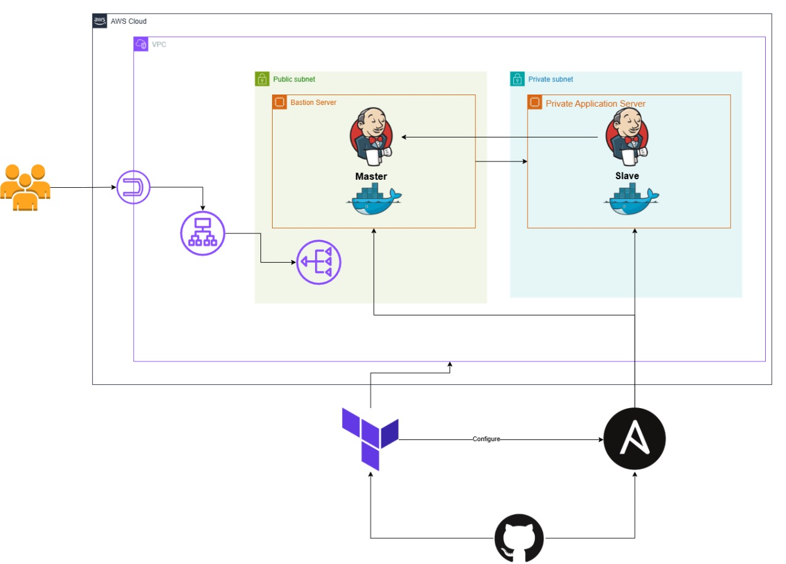

# 🛠️ Jenkins Infrastructure Automation (Terraform + Ansible + Docker)

This project fully automates the provisioning and configuration of a Jenkins master-slave setup on AWS using:

- **Terraform** – for infrastructure provisioning
- **Ansible** – for post-provisioning configuration
- **Docker** – to containerize Jenkins master and agent

## Architecture



---

Everything is triggered with **one command**:

```bash
terraform apply
````

---

## 🚀 What This Project Does

* Provisions **bastion (jump server)**, **public Jenkins master**, and **private Jenkins agent (slave)** EC2 instances.
* Configures SSH access securely via **jump server (bastion)** – no direct access to private nodes.
* Installs Docker and runs Jenkins master in a container.
* Automatically configures Jenkins using Groovy scripts.
* Dynamically joins the private EC2 node as a **Jenkins agent via JNLP** — no dashboard click required!

---

## 🔐 SSH Forwarding vs Jump Server Dilemma

In cloud environments, exposing private instances is risky. You often face a choice between:

| Approach              | Pros                                             | Cons                                               |
| --------------------- | ------------------------------------------------ | -------------------------------------------------- |
| SSH Agent Forwarding  | No need for intermediate bastion file system use | Risky if abused; requires strict SSH agent hygiene |
| Jump Server (Bastion) | Secure, auditable, and centralized SSH access    | Slightly more setup, but more robust and scalable  |

**✅ This project uses a secure Jump Server (Bastion)** to connect to private nodes via Ansible SSH proxying. No SSH forwarding is required.

---

## 🤖 Fully Automated Jenkins Setup

This project requires **no manual dashboard interaction**. Instead, it:

1. Runs Jenkins master in Docker.
2. Injects `init.groovy.d` scripts into the container to:

   * Disable the setup wizard
   * Create an admin user
   * Install plugins
   * Create a JNLP agent with secret and labels
3. The private Jenkins agent:

   * Is provisioned by Ansible
   * Has Docker and Java installed
   * Starts `jenkins-agent.jar` using the provided secret and JNLP URL

> ✅ Agent joins automatically after Jenkins master comes up.

---

## 🧰 Technologies Used

- **Terraform** (modularized):

  - `Network`: Creates the VPC, public and private subnets, and NAT Gateway.
  - `SecGrp`: Manages all security groups including SSH, HTTP, Jenkins, and egress rules.
  - `Keys`: Generates SSH key pair used for EC2 access.
  - `Bastion`: Public EC2 instance acting as a secure SSH Jump Server.
  - `PrivateServer`: Private EC2 instance that will be auto-registered as a Jenkins agent.
  - `Provisioners`: Uses `local-exec` to run Ansible and configure all instances post-deployment.

* **Ansible** (modularized into roles)

  * `docker`: Docker engine setup
  * `jenkins-master`: Jenkins Docker container + init scripts
  * `jenkins-slave`: Connects to master via JNLP
* **Docker** – containerized Jenkins for easier config and portability

---

## 📦 How to Use

```bash
# 1. Clone repo and set your variables in terraform.tfvars or use ENV vars
git clone https://github.com/Hendawyy/secure-jenkins-cicd-private-agents.git
# 2. Run Terraform
terraform init
terraform apply

# 3. Access Jenkins
http://<public-ip>:8080
```

---

## 📌 Requirements

* AWS credentials
* Public/private SSH key pair
* Terraform installed
* Ansible installed
* Docker image: `custom-jenkins:latest` with preloaded `init.groovy.d`

---

## 📎 Outputs

* `bastion_ip`: Public IP of SSH jump server
* `jenkins_url`: Public URL of Jenkins UI
* `private_ip`: Internal IP of Jenkins agent

---


## 🙋‍♂️ Maintained by Seif Hendawy

If you have any questions, suggestions, or need assistance, please don't hesitate to Contact Me [Seif Hendawy](https://www.linkedin.com/in/seif-hendawy-3995561a8/). 😉